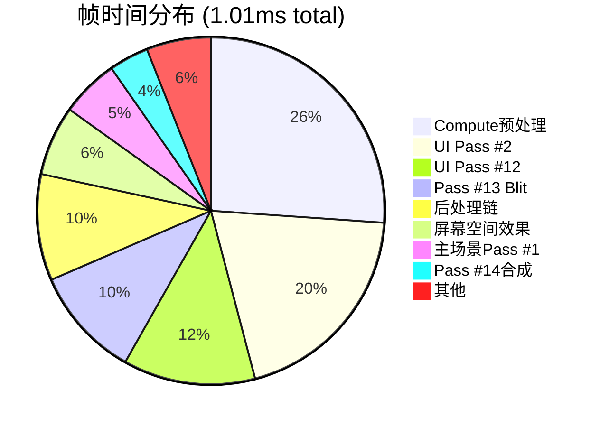
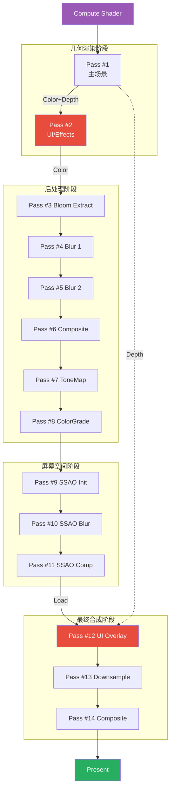
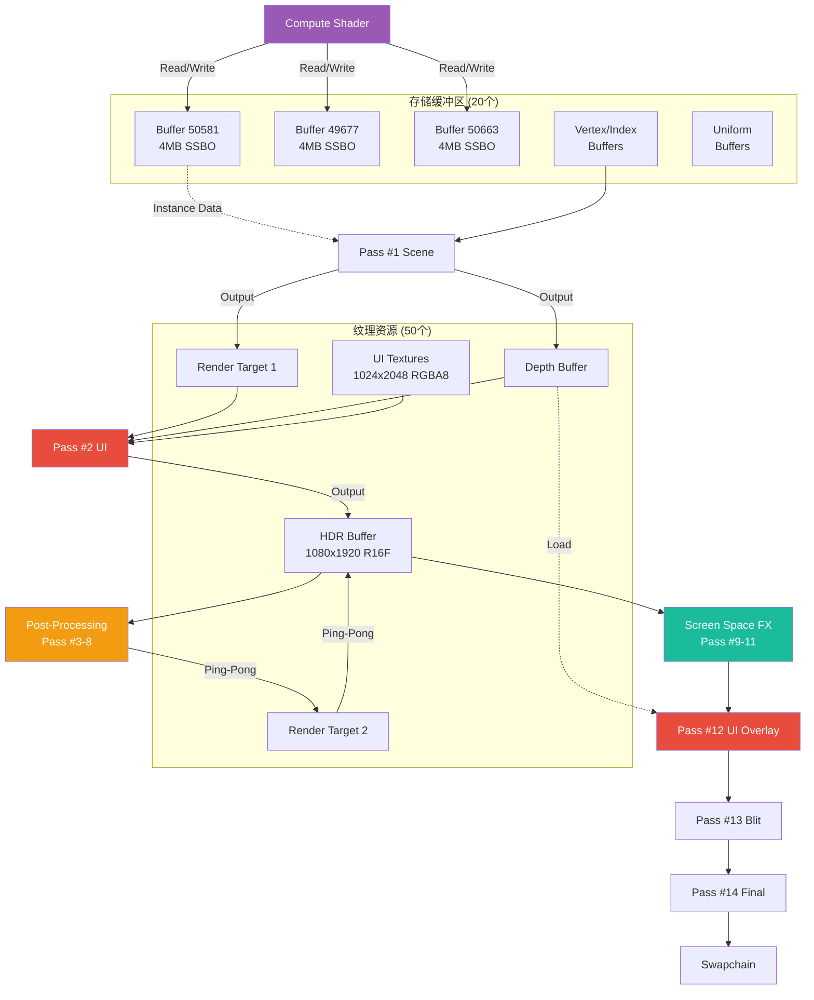
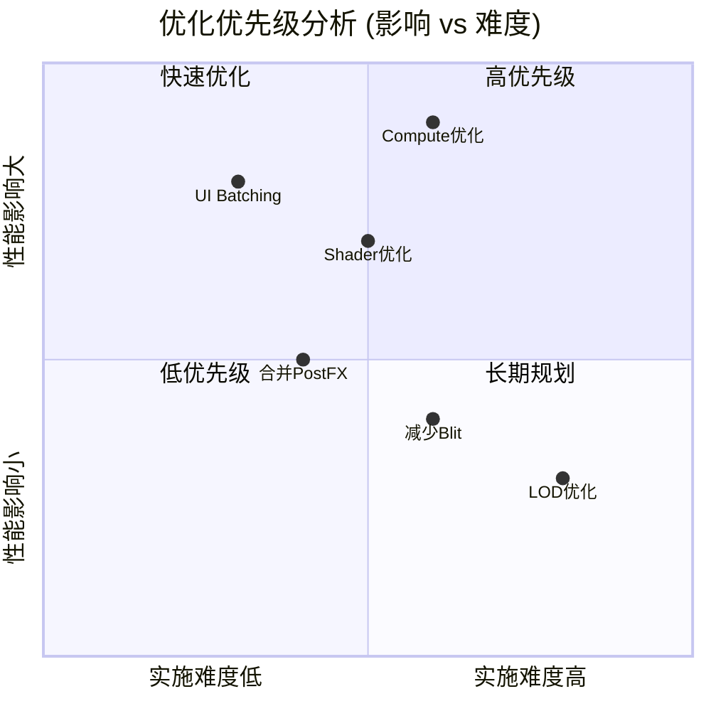
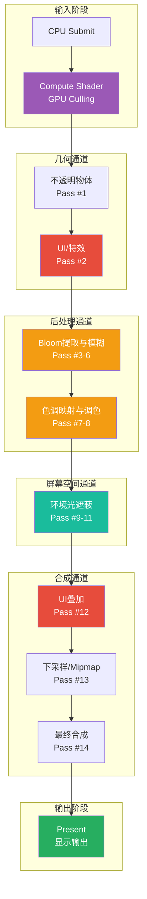

# 渲染流程图 - 冰雪魅影 (Mermaid版本)

## 完整渲染管线流程图

```mermaid
flowchart TD
    Start([🎮 FRAME START<br/>Frame 12138])
    
    Start --> Compute[⚙️ COMPUTE SHADER<br/>Event 18 | 0.264ms 26%<br/>4x Storage Buffer 4MB<br/>GPU Culling / Instance Prep]
    
    Compute --> Pass1[🏔️ PASS #1: Main Scene<br/>1 Color + Depth Clear<br/>4 Draw Calls | 0.055ms<br/>━━━━━━━━━━━━━━━<br/>• Quad 6 idx<br/>• Geometry 32,823 idx × 2<br/>• Mesh 600 idx]
    
    Pass1 --> Pass2[🎨 PASS #2: UI/Effects<br/>1 Color + Depth Clear<br/>43 Draw Calls | 0.2ms 20%<br/>━━━━━━━━━━━━━━━<br/>• UI Elements 1024x2048 RGBA8<br/>• Hotspot: Event 95 0.075ms<br/>⚠️ Needs Batching]
    
    Pass2 --> PostFX[📦 POST-PROCESSING CHAIN<br/>6 Passes | 0.1ms]
    
    PostFX --> Pass3[✨ PASS #3: Bloom Extract<br/>1 Color | 1 Quad | 0.053ms<br/>HDR Buffer R16G16B16A16F]
    
    Pass3 --> Pass4[🌟 PASS #4: Bloom Blur 1<br/>1 Color | 1 Quad | 0.013ms]
    
    Pass4 --> Pass5[🌟 PASS #5: Bloom Blur 2<br/>1 Color | 1 Quad | 0.007ms]
    
    Pass5 --> Pass6[💫 PASS #6: Bloom Composite<br/>1 Color | 1 Quad | 0.007ms]
    
    Pass6 --> Pass7[🎭 PASS #7: Tone Mapping<br/>1 Color | 1 Quad | 0.009ms]
    
    Pass7 --> Pass8[🎨 PASS #8: Color Grading<br/>1 Color | 1 Quad | 0.012ms]
    
    Pass8 --> ScreenFX[📦 SCREEN SPACE EFFECTS<br/>3 Passes | 0.066ms]
    
    ScreenFX --> Pass9[🔆 PASS #9: SSAO Init<br/>1 Color Clear | 4 Verts | 0.053ms]
    
    Pass9 --> Pass10[🌫️ PASS #10: SSAO Blur<br/>1 Color Load | 4 Verts | 0.007ms]
    
    Pass10 --> Pass11[🖼️ PASS #11: SSAO Composite<br/>1 Color Load | 4 Verts | 0.006ms]
    
    Pass11 --> Pass12[🎯 PASS #12: UI Overlay<br/>1 Color + Depth Load<br/>7 Draw Calls | 0.124ms 12%<br/>━━━━━━━━━━━━━━━<br/>• Hotspot: Event 622 0.123ms]
    
    Pass12 --> Pass13[📐 PASS #13: Downsample<br/>1 Color Don't Care<br/>Draw 0.051ms + Blit 0.053ms<br/>Generate Mipmaps]
    
    Pass13 --> Pass14[🎬 PASS #14: Final Composite<br/>1 Color Load | 6 Ops | 0.037ms<br/>━━━━━━━━━━━━━━━<br/>• Composite 3 idx 0.027ms<br/>• 2x Buffer Copy<br/>• Debug Overlay FPS/Stats]
    
    Pass14 --> Present([📺 PRESENT<br/>vkQueuePresentKHR])
    
    style Compute fill:#9b59b6,stroke:#8e44ad,stroke-width:3px,color:#fff
    style Pass1 fill:#3498db,stroke:#2980b9,stroke-width:2px,color:#fff
    style Pass2 fill:#e74c3c,stroke:#c0392b,stroke-width:3px,color:#fff
    style Pass3 fill:#f39c12,stroke:#e67e22,stroke-width:2px,color:#fff
    style Pass4 fill:#f39c12,stroke:#e67e22,stroke-width:2px,color:#fff
    style Pass5 fill:#f39c12,stroke:#e67e22,stroke-width:2px,color:#fff
    style Pass6 fill:#f39c12,stroke:#e67e22,stroke-width:2px,color:#fff
    style Pass7 fill:#f39c12,stroke:#e67e22,stroke-width:2px,color:#fff
    style Pass8 fill:#f39c12,stroke:#e67e22,stroke-width:2px,color:#fff
    style Pass9 fill:#1abc9c,stroke:#16a085,stroke-width:2px,color:#fff
    style Pass10 fill:#1abc9c,stroke:#16a085,stroke-width:2px,color:#fff
    style Pass11 fill:#1abc9c,stroke:#16a085,stroke-width:2px,color:#fff
    style Pass12 fill:#e74c3c,stroke:#c0392b,stroke-width:3px,color:#fff
    style Pass13 fill:#34495e,stroke:#2c3e50,stroke-width:2px,color:#fff
    style Pass14 fill:#34495e,stroke:#2c3e50,stroke-width:2px,color:#fff
    style Present fill:#27ae60,stroke:#229954,stroke-width:2px,color:#fff
    style Start fill:#2ecc71,stroke:#27ae60,stroke-width:2px,color:#fff
    style PostFX fill:#95a5a6,stroke:#7f8c8d,stroke-width:1px,color:#fff
    style ScreenFX fill:#95a5a6,stroke:#7f8c8d,stroke-width:1px,color:#fff
```

## 简化流程图（高层架构）


## 性能热点分布图



## 渲染Pass依赖关系图



## 资源数据流图



## GPU时间线（按比例）

```
0ms                    0.26ms              0.46ms         0.56ms    0.62ms    0.74ms     0.85ms  0.89ms  1.01ms
|                         |                   |              |         |         |          |       |       |
├─────────────────────────┼───────────────────┼──────────────┼─────────┼─────────┼──────────┼───────┼───────┤
│    COMPUTE SHADER       │    UI Pass #2     │  Post FX     │  SSAO   │  Pass12 │  Pass13  │ P14   │ Other │
│      (26.1%)            │      (19.8%)      │   (9.9%)     │ (6.5%)  │ (12.3%) │ (10.3%)  │(3.7%) │ (6%)  │
└─────────────────────────┴───────────────────┴──────────────┴─────────┴─────────┴──────────┴───────┴───────┘
         🔴 HOT                   🔴 HOT                                     🔴 HOT

图例:
🔴 性能热点 (>10% frame time)
🟢 优化良好 (<5% frame time)
```

## 优化优先级矩阵



## 渲染管线架构总览



---

## 使用说明

1. **查看HTML版本**: 双击 `渲染流程图_冰雪魅影.html` 在浏览器中打开，可交互、可缩放
2. **查看Mermaid版本**: 在支持Mermaid的Markdown编辑器中查看此文件
3. **GitHub/GitLab**: 自动渲染Mermaid图表
4. **VS Code**: 安装 "Markdown Preview Mermaid Support" 插件

---

*生成时间: 2026-03-31*  
*工具: RenderDoc + Claude AI*
